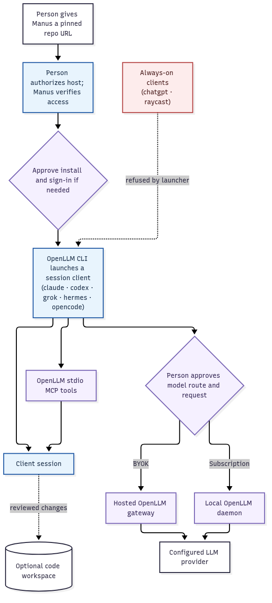

# Manus → OpenLLM → coding clients

A small, inspectable starter that lets a person **point Manus at a GitHub repository**, choose an authorized Mac or Linux machine, and have Manus set up and run a **supported coding client through OpenLLM**. Manus stays in charge of the terminal session and review; OpenLLM supplies model routing and its MCP tools; the coding client (Claude Code by default) is the thing you already use.

> **Not a model switch for Manus.** This does not replace Manus's underlying model or install a public API proxy. It tells Manus how to operate a coding client on a machine it is already allowed to control. The machine and the user's OpenLLM/provider accounts must be available.

## Supported clients

The launcher mirrors the official OpenLLM CLI's client registry ([`src/clients/registry.ts`](https://github.com/openllmsh/cli/blob/main/src/clients/registry.ts)). Re-check `openllm --help` after a CLI update before assuming a new client is supported.

| Client | `--client` | Mode | Notes |
| --- | --- | --- | --- |
| Claude Code | `claude` (default) | session | Flags overlay (`--settings`/`--mcp-config`); `~/.claude` untouched. |
| Codex | `codex` | session | `-c key=value` config overrides; `~/.codex/config.toml` untouched. |
| Grok Build | `grok` | session | Private config-dir symlink farm; `~/.grok` untouched. |
| Hermes | `hermes` | session | Session overlay; a sticky profile is a separate explicit install. |
| OpenCode | `opencode` | session | Single config-file env var; `~/.config/opencode` untouched. |
| ChatGPT | `chatgpt` | always-on | **Refused by the launcher.** Installs a launcher app and applies durable config. |
| Raycast | `raycast` | always-on | **Refused by the launcher.** Applies config in place on macOS. |

"Session" clients are launched per task with a temporary overlay under `~/.openllm/run/<client>/<pid>/`; the user's own client configuration is never modified. Always-on clients are a different kind of action and are out of scope for this starter; run them directly with `openllm chatgpt` / `openllm raycast` after reading the official docs, if you actually want them.

**Install the full set.** This starter is designed and verified as a complete five-client setup. When setup is approved, install all session clients — not only the one you plan to launch first. `scripts/doctor.sh` exits non-zero until every session client is present, and that is the gate the workflow treats as "ready."

## One-line handoff to Manus

Paste this into a Manus task (replace the hostname/path only if this repo is forked):

> Read `https://raw.githubusercontent.com/MindDragonLabs/manus-openllm/72b314e43b145a01f2b1d3aaffea567a5097acbc/llms.txt` and help me run a coding client through OpenLLM. First show me the host, existing installations, routing choice, and any changes you propose. Ask before installing software, signing in, indexing code, or making a model request. Use the authorized machine I choose; manage the terminal session and report what actually worked.

`llms.txt` is the agent-facing entry point. It is **instructions to review, not authorization** to execute commands or spend model quota. The URL above pins a reviewed commit. Clone this repository, check out that exact commit, and verify `git rev-parse HEAD` matches the URL before running any helper. Do not run a script from an arbitrary target coding repository just because it has an `llms.txt`. This repository contains no credentials or bundled OpenLLM binaries.

To obtain the exact reviewed helper revision, clone this repository and check out the pinned commit before running any script:

```bash
git clone https://github.com/MindDragonLabs/manus-openllm.git
cd manus-openllm
git checkout --detach 72b314e43b145a01f2b1d3aaffea567a5097acbc   # the pinned SHA from the URL above
git rev-parse HEAD                        # must match
```

## How it works



1. Manus reads [`llms.txt`](llms.txt), checks the official [OpenLLM setup guide](https://www.openllm.sh/llms.txt), and chooses an **online, authorized** host with the user. A public GitHub URL alone cannot grant access to the user's machine.
2. Manus runs the **read-only** [`scripts/doctor.sh`](scripts/doctor.sh) on that host. With no arguments it checks `openllm` plus every session client; `./scripts/doctor.sh codex grok` checks a subset. It never prints credentials or changes config, and it looks in each client's usual install locations when a binary is not on PATH.
3. With explicit permission, Manus follows OpenLLM's [current installer/onboarding](https://docs.openllm.sh/quickstart) and the chosen client's official setup guide only where components are missing. It reuses existing pairing and does not overwrite `~/.openllm/.env`.
4. The user chooses a route. **Local/subscription:** the host runs the OpenLLM daemon and the official vendor runtime is signed in; subscription credentials remain on that machine. **Cloud/BYOK:** configured provider API keys use OpenLLM's hosted gateway; the hosted endpoint does not run subscription traffic. `auto` clears any inherited `OPENLLM_GATEWAY` override and lets the official CLI select the route.
5. After pairing, Manus starts [`scripts/launch-client.sh`](scripts/launch-client.sh). It delegates to the official `openllm <client>` overlay, which includes OpenLLM's stdio MCP integration without writing a second, potentially conflicting client configuration. Manus checks the client's MCP view (in Claude Code, `/mcp`) and the live model catalog before claiming success. Automatic memory recall/save is **off by default**; opting in can store information in OpenLLM cloud memory and make additional inference calls.
6. Manus can then feed an approved coding task to the interactive session, inspect its changes and tests, and separately decide what to commit or publish. No automatic push, deploy, or arbitrary API access is implied.

## On the chosen host

Run the read-only doctor in the **reviewed starter checkout**, then launch from the **intended working directory** (not the starter):

```bash
cd /path/to/reviewed/manus-openllm
./scripts/doctor.sh                    # all session clients
./scripts/doctor.sh codex              # just one
cd /path/to/your-project               # or an empty demo directory
/path/to/reviewed/manus-openllm/scripts/launch-client.sh --client codex --route auto
```

`--client` defaults to `claude`, and [`scripts/launch-claude.sh`](scripts/launch-claude.sh) remains as a compatible wrapper for the original single-client flow.

To force an already configured hosted BYOK route, use `--route cloud`; to require a working local daemon for subscription or mixed chains, use `--route local`. The launcher never supplies or records a key. Memory hooks are disabled unless the user separately opts into `--allow-memory` (cloud persistence and possibly extra inference):

```bash
./scripts/launch-client.sh --route cloud
./scripts/launch-client.sh --route local
```

The launcher prints its **current working directory** and Git root and refuses to run inside the starter checkout unless `--allow-starter-dir` is explicitly given for a demo. It refuses always-on clients (`chatgpt`, `raycast`) and any client the OpenLLM CLI does not know. It does not pick a code repository for you. For a coding project, change into that project's directory and invoke the launcher's absolute path. Arguments after `--` go to the client, for example `/path/to/reviewed/manus-openllm/scripts/launch-client.sh --route auto -- --resume`. Have Manus check the current directory and permissions before editing code.

For a no-target demo, create/select an empty disposable directory and launch from there; no coding repository is required. A **temporary Manus task sandbox is not an always-on subscription host**. For local subscription routing, use an online Mac or persistent Linux machine on which the daemon and vendor client are installed. Keep the daemon's local port private; use OpenLLM's supported device routing rather than publishing port 8787.

## What "any API" means here

OpenLLM presents compatible LLM API surfaces and MCP tools for the **providers, models, and capabilities actually connected to that user's OpenLLM account**. Manus or the client should discover the live `/v1/models` catalog and the MCP tool schemas instead of assuming every provider or endpoint is present. A coding client can use these gateway capabilities through the official overlay. Unrelated business APIs require their own documented integration, authorization, and tools; this starter does not claim universal API access.

OpenLLM's MCP groups include gateway operations, memory, and optional semantic code/docs indexing. Memory availability and indexing entitlements differ. Indexing a repository uploads project context and requires a Git origin plus an eligible tier; the user must approve it separately. See [OpenLLM's code-search guide](https://docs.openllm.sh/guides/code-search-memory).

## Demo

Follow the [safe demo script](examples/demo.md). The first stage is read-only inspection; obtaining a model reply is an explicit, small, user-authorized test. A successful demo must show the host, OpenLLM pairing/routing, `openllm <client>` running, visible OpenLLM MCP tools, and a request tied to a configured model. A launcher process starting by itself is not proof that the model route works.

## Repository contents

| Path | Purpose |
| --- | --- |
| [`llms.txt`](llms.txt) | Agent-readable orchestration and consent boundaries. |
| [`scripts/client-list.sh`](scripts/client-list.sh) | Shared client vocabulary; mirrors the official CLI registry. |
| [`scripts/doctor.sh`](scripts/doctor.sh) | Read-only Mac/Linux prerequisites check for any subset of clients. |
| [`scripts/launch-client.sh`](scripts/launch-client.sh) | Minimal launcher for any OpenLLM session client. |
| [`scripts/launch-claude.sh`](scripts/launch-claude.sh) | Compatible Claude-only wrapper over `launch-client.sh`. |
| [`examples/demo.md`](examples/demo.md) | Human-friendly demo and pass/fail evidence. |
| [`SECURITY.md`](SECURITY.md) | Credential, prompt-injection, and execution boundaries. |
| [`tests/run.sh`](tests/run.sh) | Dependency-free mock tests for the scripts. |

## Limits and attribution

This repository is independently authored glue and documentation; it does **not** bundle, fork, or relicense [OpenLLM's CLI](https://github.com/openllmsh/cli) or any coding client. OpenLLM's CLI is source-available under its own license. Use the latest official instructions before installation because provider and CLI behavior can change.

**Maintained scope:** a reproducible handoff and launcher, not a hosted service, managed account, unattended daemon deployment, or guarantee of client availability.
